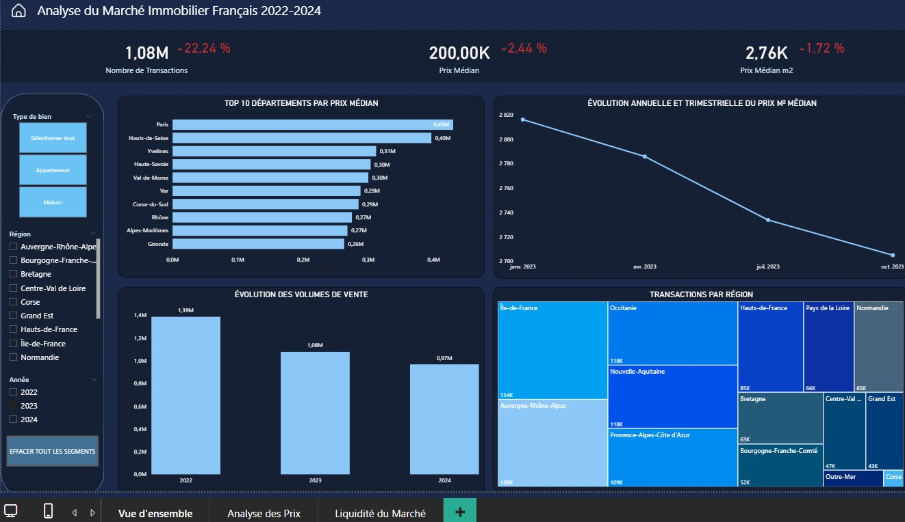
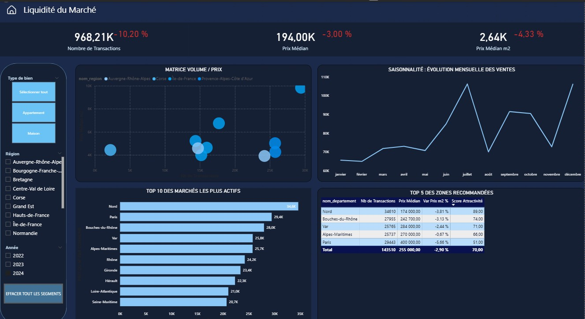

# Analyse du Marché Immobilier Français (2022 - 2024)

Ce projet est une analyse complète des transactions immobilières en France ("Demandes de Valeurs Foncières"), visant à identifier les dynamiques de marché et les zones d'investissement résilientes.

## Objectifs et Réalisations
* **Traitement de la donnée :** Extraction et nettoyage d'une base brute de **12 millions de lignes** pour isoler les 1,1 million de transactions pertinentes (Maisons/Appartements).
* **Création d'un Algorithme de Scoring :** Développement en DAX d'un "Score d'Attractivité" (de 0 à 100). Ce modèle pondère le volume de transactions (liquidité) et la variation des prix (résilience) pour identifier les meilleures opportunités dans un marché baissier.
* **Outils utilisés :** PostgreSQL (Nettoyage/Filtres), Power Query (Modélisation), Power BI (Dataviz & DAX).

## Aperçu du Dashboard

### 1. Vue d'ensemble du marché

### 2. Analyse des Prix

### 3. Liquidité du Marché et Recommandations

### 1. Liquidité du Marché et Recommandations
Cette vue intègre mon modèle statistique de scoring pour identifier le "Top 5" des départements les plus résilients. Le département du Nord se détache avec un score de 89/100, prouvant sa forte liquidité malgré la conjoncture.

### 2. Vue d'ensemble et Évolution
Analyse macro-économique montrant une baisse des volumes et des prix médians au m² sur la période étudiée, nécessitant une analyse fine par région.
