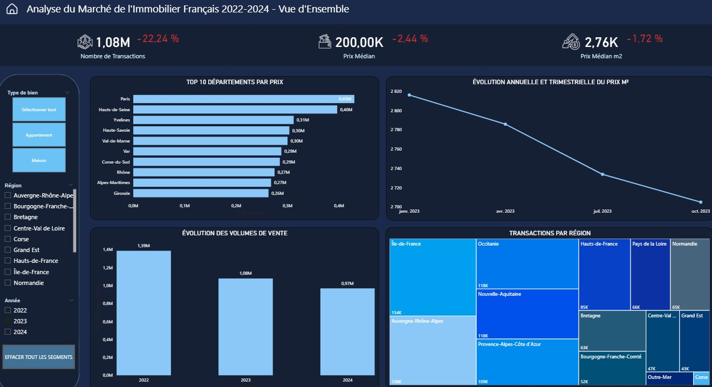
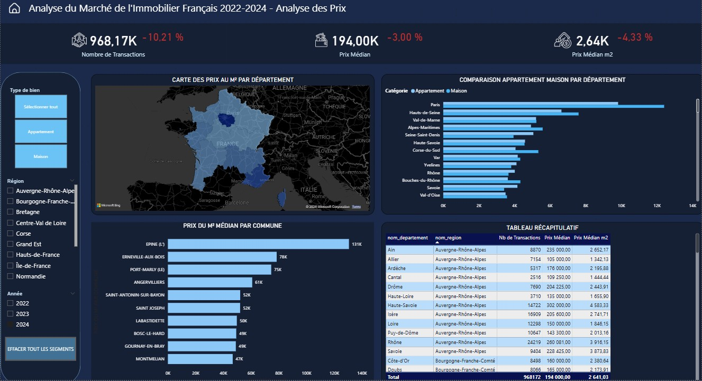
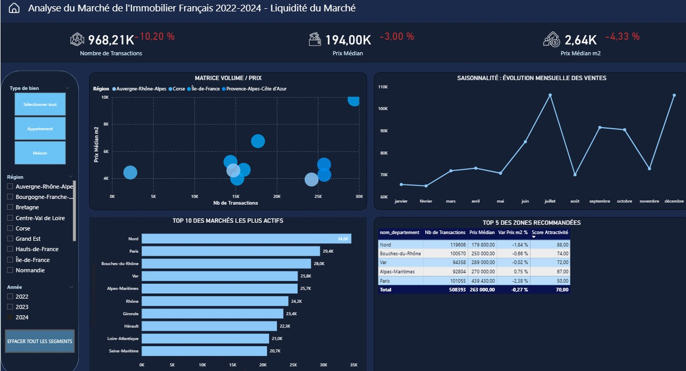

# Analyse du Marché Immobilier Français (2022 - 2024)

Ce projet est une analyse complète des transactions immobilières en France ("Demandes de Valeurs Foncières"), visant à identifier les dynamiques de marché et les zones d'investissement résilientes.

**Contexte Macro-économique :** Entre 2022 et 2024, le marché a subi une chute brutale de **-30 % de son volume de ventes** (passant de 1,39 million à 968 000 transactions). Cette paralysie, causée principalement par la flambée des taux d'intérêt et le durcissement des conditions de crédit, rend l'analyse de la donnée indispensable pour repérer les rares départements qui conservent une forte liquidité.

## Objectifs et Réalisations
* **Traitement de la donnée :** Extraction et nettoyage d'une base brute de **12 millions de lignes** pour isoler les 1,1 million de transactions pertinentes (Maisons/Appartements).
* **Création d'un Algorithme de Scoring :** Développement en DAX d'un "Score d'Attractivité" (de 0 à 100). Ce modèle pondère le volume de transactions (liquidité) et la variation des prix (résilience) pour identifier les meilleures opportunités dans un marché baissier.
* **Outils utilisés :** PostgreSQL (Nettoyage/Filtres), Power Query (Modélisation), Power BI (Dataviz & DAX).

## Contrainte technique rencontrée et résolution
Les fichiers issus du dataset utilisent la virgule comme séparateur 
décimal (format français). PostgreSQL ne reconnaissant 
pas ce format, j'ai importé toutes les colonnes en TEXT 
puis utilisé REPLACE(valeur_fonciere, ',', '.') 
pour convertir les valeurs au moment des requêtes.

## Aperçu du Dashboard

### 1. Vue d'ensemble du marché

**Insight :** Baisse globale de -22% du volume 
de transactions sur la période 2022-2023 et -30.32% sur la période 2022-2024

### 2. Analyse des Prix

**Insight :** Paris (-13%) et Hauts-de-Seine (-15%) sont les marchés les plus touchés par la crise malgré leur positionnement élevé.

### 3. Liquidité du Marché et Recommandations

**Insight :** Cette vue intègre mon modèle de scoring DAX 
pour identifier le Top 5 des départements les plus résilients. 
Le Nord se détache avec **89/100**, prouvant sa forte liquidité 
malgré la conjoncture baissière.

## Conclusion
Dans un marché en contraction (-30% de volume), 
les marchés abordables (Nord, Bouches-du-Rhône) 
surperforment les marchés premium (Paris -13%, 
Hauts-de-Seine -15%).
